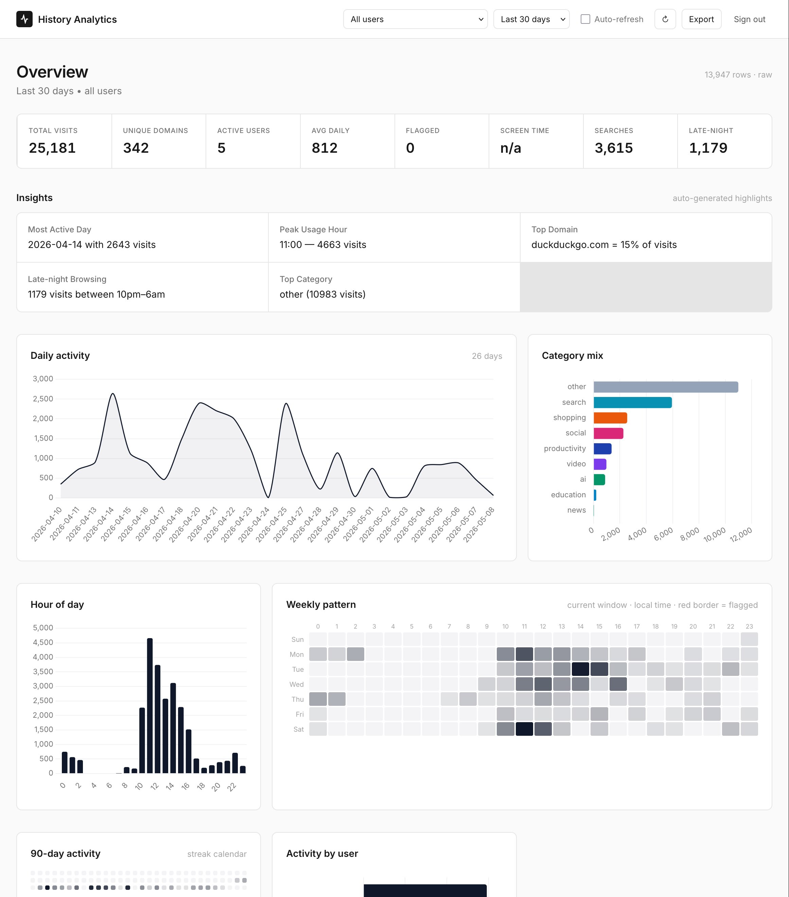

# PocketHistory

Self-hosted browser-history analytics. Browser extensions on your devices push every visit to a private, self-hosted [PocketBase](https://pocketbase.io) instance; a single-page dashboard gives you parental-style insight (top domains, search queries, flagged content, weekly heatmap, drill-down by domain → path) without sending anything to a third party.

Built for visibility into kids' browsing, but works fine as a personal browsing log, too.



```
chrome ext  ───┐
firefox ext ───┼──▶  PocketBase  ───▶  Alpine.js dashboard
                │     ├─ history (raw rows)
                │     ├─ history_daily          ◀──┐
                │     ├─ history_hourly_profile ◀──┤  rolled up by
                │     ├─ history_user_totals    ◀──┤  cron every 10 min
                │     └─ history_search_daily   ◀──┘
                │     ├─ domain_categories  (extensible classifier)
                │     └─ system_state       (rollup cursor)
```

## Repository layout

| Path | What it is |
|---|---|
| `pocketbase-history-chrome/` | MV3 Chrome extension. Polls `chrome.history` once a minute and POSTs new visits. |
| `pocketbase-history-firefox/` | Same thing for Firefox. |
| `dashboard/` | Static SPA — Alpine.js + Chart.js + Tailwind via CDN. No build step. |
| `pb_hooks/` | PocketBase JS-VM hooks: insert-time enrichment + 10-minute cron for dedup and rollups. |
| `pb_schema.json` | All collections. Import via PocketBase admin → *Settings → Import collections*. |
| `scripts/backfill_rollups.js` | One-shot Node script to rebuild rollups from existing history (and dedup historic rows). |
| `marketing/` | Landing page assets (separate concern). |

## How a visit flows through the system

1. **Sync** — the extension reads `chrome.history` every minute and POSTs new items to `https://your-pb/api/collections/history/records`.
2. **Enrich (synchronous)** — `pb_hooks/main.pb.js → onRecordCreate` parses the URL with `new URL()` and stamps `domain` (host with port), `path`, `query`, `protocol`, `category`, `flagged`, and `search_query` on the row. Lookups go through `pb_hooks/lib.js → lookupCategory()`, which checks the `domain_categories` table first and falls back to a hardcoded list.
3. **Dedup + roll up (cron, every 10 min)** — `pb_hooks/main.pb.js → cronAdd("history-rollup", "*/10 * * * *", …)` reads the cursor from `system_state`, pulls history rows whose `created` timestamp is in `(cursor, now − 60s]`, and:
   - Groups by `(user_id, url)`. Within each group, any row whose `visit_time` is within 10 minutes of the earliest row in the group is merged into that earliest row — `visit_count` summed, duplicate row deleted.
   - Increments the four rollup tables from the surviving rows.
   - Advances the cursor.
   The whole tick runs in a transaction — partial failures roll back and are retried next tick.
4. **Read** — the dashboard fetches raw `history` for short windows (≤ 90 days, gives URL/path detail), and `history_daily` / `history_search_daily` / `history_hourly_profile` for longer windows (so opening "All time" doesn't try to load 3 GB into the browser).

## Domain classifications

`domain_categories` is a regular PocketBase collection. Each row classifies one domain.

| Field | Meaning |
|---|---|
| `domain` | Hostname (e.g. `youtube.com`, `news.ycombinator.com`) — case insensitive, no port. |
| `category` | One of `social`, `video`, `gaming`, `news`, `adult`, `education`, `shopping`, `productivity`, `search`, `ai`, or any custom label you make up. |
| `flagged` | Boolean. `true` means visits to this domain show up in the dashboard's red-bordered "Flagged visits" panel and bump the `flagged` KPI. |
| `match_type` | `exact` (only `domain` matches) or `suffix` (matches `domain` and any subdomain — recommended default). |
| `notes` | Freeform — why you classified it this way. |

### Lookup order

For each visit's hostname, `lookupCategory()` walks this priority list and returns the first match:

1. DB row with `match_type=exact` and `domain == hostname`.
2. DB row with `match_type=exact` and `domain == rootDomain(hostname)` (last two labels).
3. DB row with `match_type=suffix` whose `domain` equals or is a parent of `hostname`. Longest match wins.
4. Hardcoded fallback in [`pb_hooks/lib.js`](pb_hooks/lib.js) and [`dashboard/categories.js`](dashboard/categories.js) (~150 common sites).
5. `other`.

This means the DB **overrides** the hardcoded list — adding a row is enough to re-categorize a domain or add a new one. The hardcoded list exists so the dashboard works on a fresh install before the table has been seeded.

### Seeding

On first PocketBase boot with these hooks deployed, `onBootstrap` calls `seedDomainCategoriesIfEmpty()`, which walks the bundled `CATEGORIES` map in `pb_hooks/lib.js` and inserts a `suffix`-match row for every entry (the `adult` group additionally gets `flagged=true`). If the table already has any row, seeding is skipped — your edits are safe across restarts.

### Adding or overriding a classification

Open PocketBase admin → **Collections → domain_categories** and create a row:

```
domain      = github.com
category    = productivity
flagged     = false
match_type  = suffix
notes       = also catches *.github.io
```

Changes are picked up:

- **Dashboard**: on next page reload (it caches the table on login).
- **Server enrichment**: each insert hook runs in its own VM and re-reads the table, so newly added classifications apply to the next inserted history row.
- **Rollups**: rollups read existing `category`/`flagged` from the row, so re-classifying a domain doesn't retroactively re-bucket already-rolled-up data. Re-run the backfill script if you want historic rows rewritten.

### Adding a new category label

Categories aren't constrained to the built-in set — write whatever string you want into `category`. The dashboard's badge/legend coloring is defined in [`dashboard/app.js`](dashboard/app.js) (`CATEGORY_COLORS` and `badgeClass()`) — unknown categories fall back to neutral gray.

## Setup

### 1. PocketBase

Install PocketBase 0.23+ on your server. Copy `pb_hooks/` into the PocketBase data directory (sibling to `pb_data/`):

```
your-pb-dir/
├── pocketbase
├── pb_data/
└── pb_hooks/
    ├── main.pb.js
    └── lib.js
```

Start PocketBase, log into the admin UI, and **import** `pb_schema.json` via *Settings → Import collections*. On the next process restart, the cron will start ticking and `domain_categories` will seed itself.

### 2. Backfill (one-time)

If you already have history rows, run the backfill once to dedup historic data and populate the rollup tables:

```bash
npm i pocketbase
POCKETBASE_URL=https://your-pb \
PB_ADMIN_EMAIL=admin@you.com PB_ADMIN_PASSWORD=… \
node scripts/backfill_rollups.js
```

Env knobs:
- `DEDUP=0` — skip the dedup pass (rebuild rollups only).
- `UPDATE_HISTORY=0` — don't write enrichment back to raw history rows.
- `PAGE_SIZE`, `FLUSH_BATCH` — tune for memory vs throughput.

### 3. Browser extensions

Install the unpacked extension from `pocketbase-history-chrome/` (Chrome) or `pocketbase-history-firefox/` (Firefox) and configure it via the popup (PocketBase URL + your email).

### 4. Dashboard

Serve `dashboard/` as static files. Anything works — `python3 -m http.server`, nginx, Caddy, GitHub Pages — there's no build step. Hit it in a browser, sign in with a PocketBase user.

For local development:

```bash
python3 -m http.server 8765 --directory dashboard
```

The PocketBase URL is hardcoded in [`dashboard/app.js`](dashboard/app.js) (`POCKETBASE_URL` constant) — change it to your instance.

## What the dashboard shows

- **KPI strip** — total visits · unique domains · active users · avg daily · flagged · screen time · searches · late-night.
- **Insights** — auto-generated highlights (most active day, peak hour, top domain share, flagged count, late-night activity, top category).
- **Daily activity trend** (line) and **Category mix** (horizontal bar).
- **Hour-of-day** (bar) and **Weekly pattern** (24×7 lifetime heatmap with red borders on hours that contained flagged visits).
- **90-day streak calendar** — GitHub-style.
- **Per-user activity** (when filter = All users) and **Dwell time by category** (when extensions report `duration`).
- **Top domains** — clickable list. Click one to drill in: every other panel reflects only that domain, and the **Top paths** panel populates with sub-page counts under it.
- **Top searches** — extracted from search-engine URLs (Google, Bing, DuckDuckGo, YouTube, Amazon, etc.) so you see actual query strings.
- **Flagged visits** — red-bordered panel listing every visit to a `flagged=true` domain.
- **Recent activity** — last 100 visits with category badges.
- **Top URLs** — legacy full-URL view for the current window.

Filters: per-email user dropdown (one entry per email even if the user has multiple devices), date-range presets (Today / 7d / 30d / 90d / 1y / All / Custom), domain drill-down, optional 60-second auto-refresh, CSV export.

## Operational notes

### Manually triggering a rollup tick

The cron fires every 10 minutes. To run it on demand:

```bash
curl -X POST https://your-pb/api/history/rollup \
  -H "Authorization: $SUPERUSER_TOKEN"
```

### Cleaning up local-development noise

A second cron (`history-purge-private`) runs at minute 15 of every hour and deletes any history (and corresponding `history_daily` rows) whose `domain` matches a private-network or loopback address — by default `localhost[:port]`, `127.0.0.1[:port]`, `192.168.*`, and IPv6 `[::1]`. Edit `PRIVATE_HOST_FILTERS` in [`pb_hooks/lib.js`](pb_hooks/lib.js) to extend (e.g. add `'domain ~ "10."'` for the `10.0.0.0/8` RFC1918 range, or `172.16.`–`172.31.` for `172.16/12`).

Manually:

```bash
curl -X POST https://your-pb/api/history/purge-private \
  -H "Authorization: $SUPERUSER_TOKEN"
```

`history_hourly_profile` and `history_user_totals` aren't pruned — they have no domain column. Their counts may be very slightly inflated by the visits we purge from `history`, which is fine for a dev-cleanup job.

### Why two user identifiers exist

`history.user_id` is a per-device random ID generated by the extension on first install. `history.user_email` is the email the user types into the extension popup. The dashboard groups and filters by `user_email` — one email can map to multiple `user_id`s when a person uses several devices. Don't confuse `history.user_id` with the PocketBase auth user's `id`; they're unrelated.

### When the dropdown is empty

The dropdown is sourced from `history_user_totals` (the rollup). On a fresh install where no cron tick has run yet, the dashboard falls back to scanning the most recent 500 raw history rows for distinct emails. If both are empty, you have no synced data — check the extension's popup status.

### Performance and storage

- The dashboard's **short-window** mode (≤ 90 days) hits raw `history` paginated 500 rows at a time, capped at 50 000 total per load.
- The **long-window** mode hits `history_daily` and friends — bounded at "domains × days × users" rows, fast even for years of data.
- Indexes on `(user_id, visit_time DESC)`, `(domain, visit_time DESC)`, and `(domain, path)` keep filtered queries snappy as the table grows.

### Privacy

Everything runs on your hardware. No third-party analytics, no cloud sync, no telemetry. Adult-domain classifications are part of the seeded list so visits to those sites get flagged automatically — edit `domain_categories` if you disagree with any specific entry.

## License

See [LICENSE](LICENSE).


